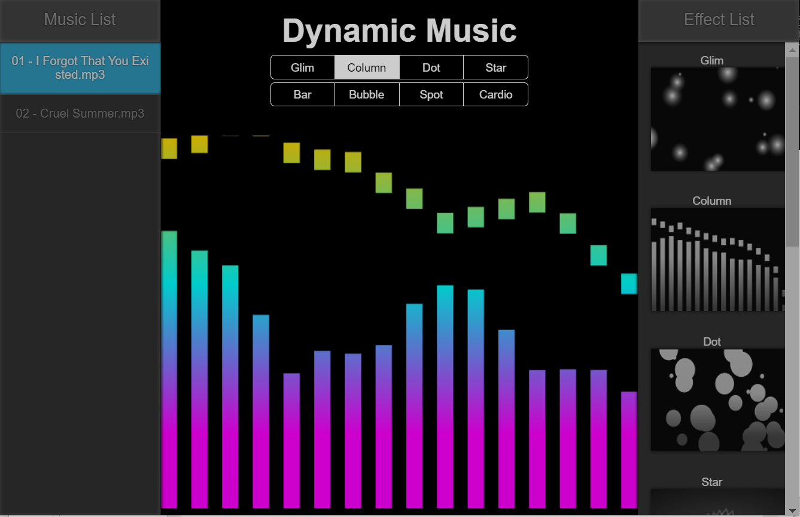
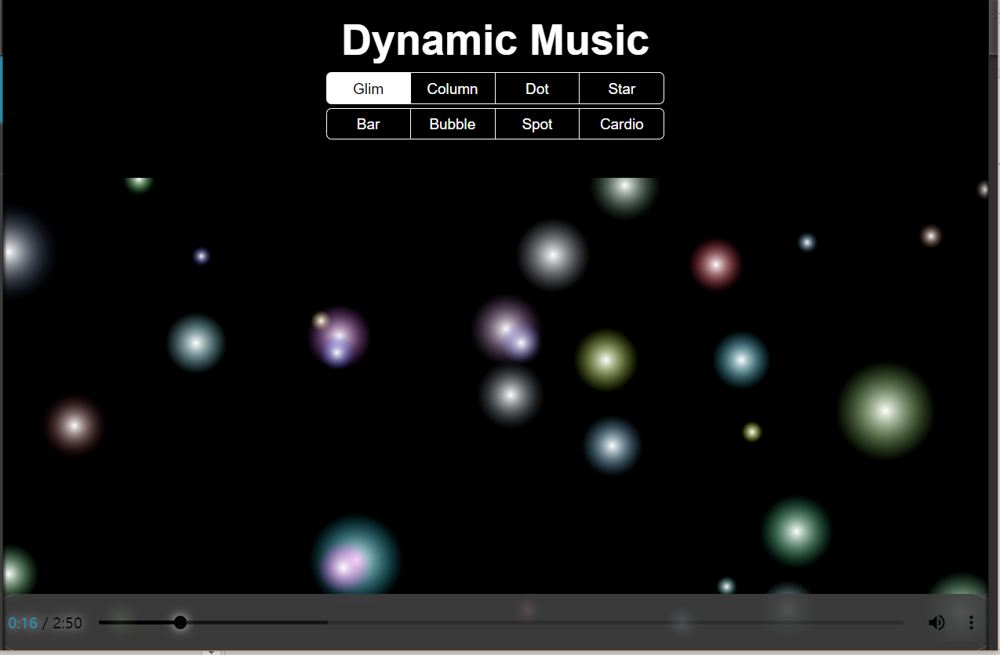
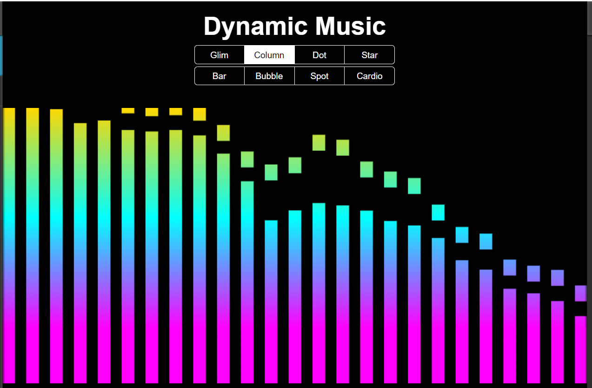
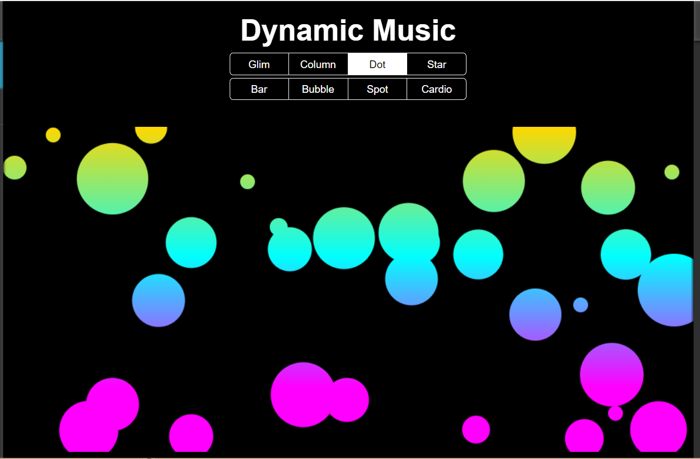
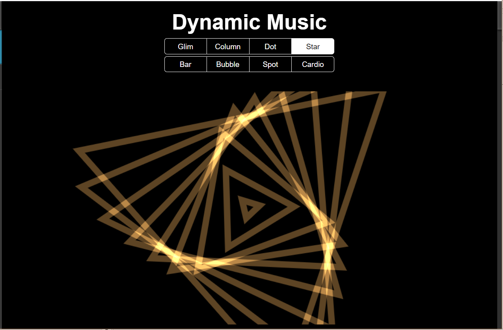
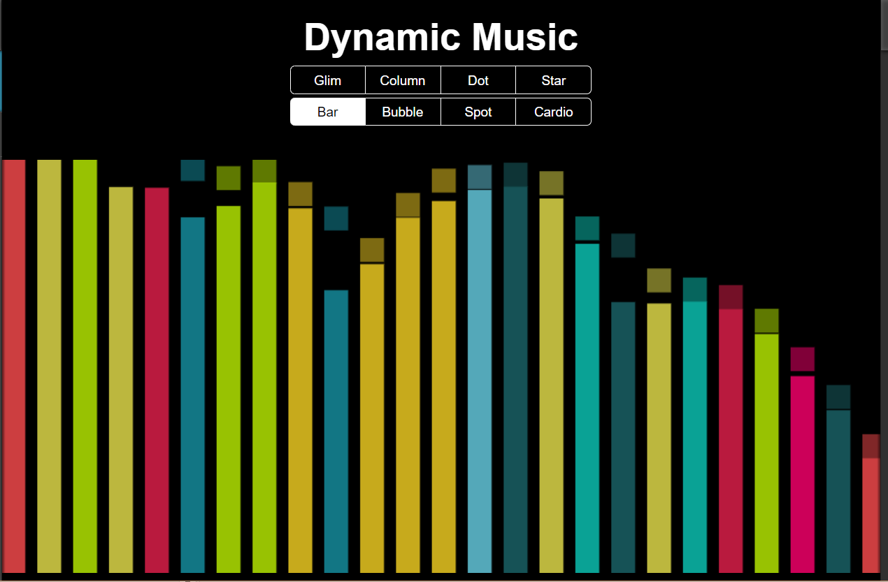
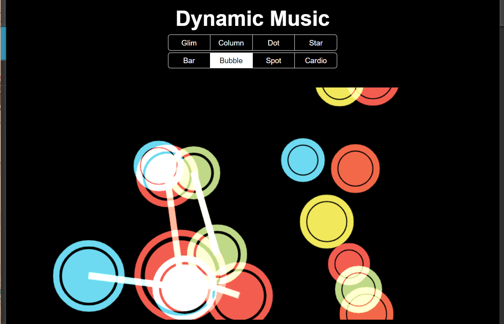
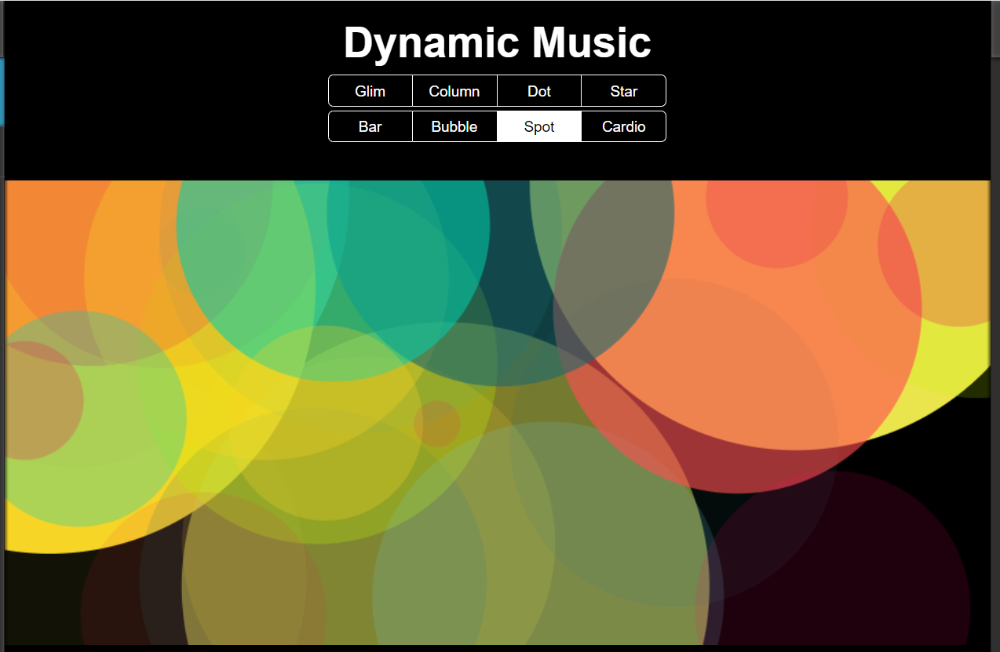
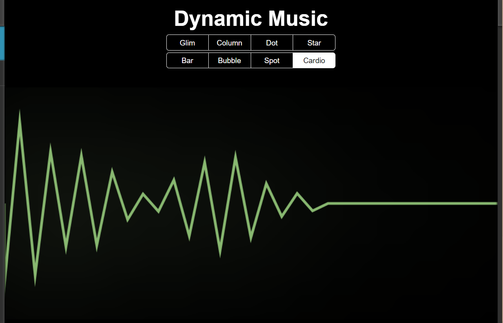

## Dynamic Music 
This is a music visualization program for IS305
#### Prerequisites
* Windows 10
* Node.js 14.16.0
#### Usage
```buildoutcfg
# type in your command line
npm install 
npm install -g supervisor
supervisor ./bin/www
# type in your browser
http://localhost:3000/
```
#### Function
Multiple music visulization options in this project.
##### Baic music plying function
*  resume or pause music with the right mouse button
*  load the music in the folder(./media) automatically
*  add songs you like to the playlist
*  adjust the volume 
*  download the music 
*  drag the progress bar

##### Music Visualization
* This program provide a wide range of visulization options, 
including bars , glimming dots, waves, cardiogram, spinning star
 and streching bubbles. 
* The element on the canvas will change according to the rhythm and speed 
of music and give you a pleasant and enjoyable experience.
* You can either change the effect by clicking the effect list or click the 
option below the title. 
1. Glimming Dots shift to the left

2. Gradient Columns

3. Gradient Dots

4. Spinning Stars

5. Common Bars

6. Bubbles& Links

7. Stretching Spots

8. Electrocardiogram


##### Help page
* view the help page
* hidden the progress bar
* hide the play list and effect list.
-------
#### To do
* Enrich the visualization effects
* Add register and login for users


